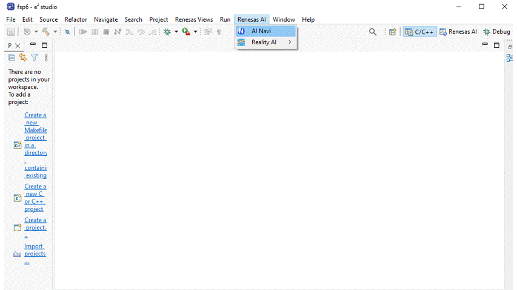
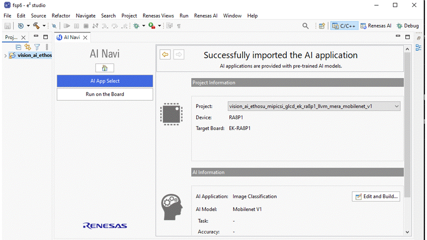

# Introduction

 Image Classification project uses a camera module and LCD display to display the items in the table below as AI Predictions:  

| No   | Content            | Description      |
| ---- | --------------- | --------- |
|1|AI Model|mobilenetv1|
|2|Inference time|Displays inference time in milliseconds|
|3|TOP 5 accuracy|The Top-5 predicted class labels along with their confidence scores on the screen|

    

Power on the EK-RA8P1 Kit with any of the USB connectors that are available.  
The Image Classification operation is demonstrated in renesas.com/EK-RA8P1  

## Before you start  

### Hardware setup  
Ensure you have completed the board setup steps for RA8P1 in its respective READMEs.  

## Lauch AI Navigator and Import sample AI Application.  

 

 
## Compile the sample application and load artifact to EK-RA8P1

  

