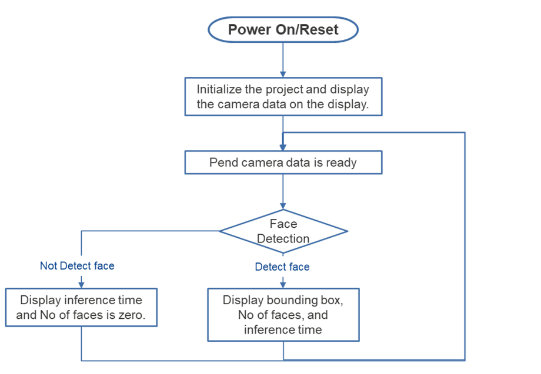
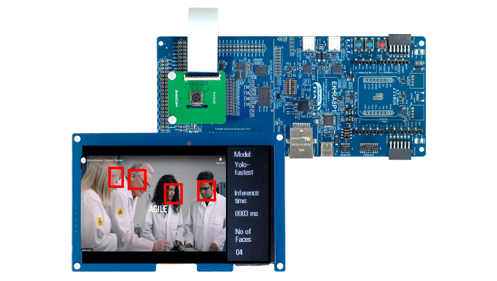

# Introduction

The Face Detection project utilizes a camera module and an LCD display to show items from a table and overlay bounding boxes on detected faces.:  

| No   | Content            | Description      |
| ---- | --------------- | --------- |
|1|AI Model|Yolo-fastest|
|2|Inference time|Displays inference time in milliseconds|
|3|Num of face|Count the number of faces|

    

Power on the EK-RA8P1 Kit with any of the USB connectors that are available.  
The Image Classification operation is demonstrated in renesas.com/EK-RA8P1  

